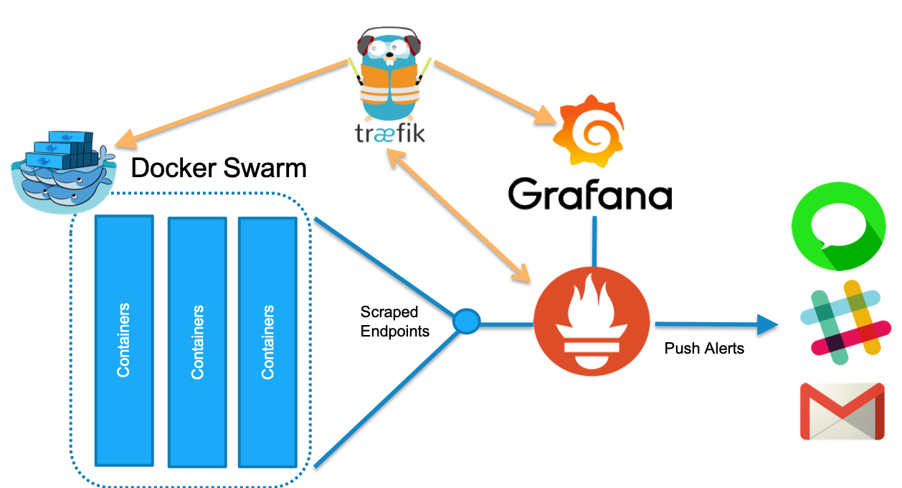

# Merge of Two Repositories

 1. https://github.com/vegasbrianc/docker-traefik-prometheus
 2. https://github.com/thinkst/canarytokens-docker/

# Install Guide

Fill in all the *.env files with your system specific information.

Pre Ubuntu 20.04
 ```shell
sudo apt-get install python-pip python-dev libyaml-dev
sudo pip install -U docker-compose
```

Ubuntu 20.04 Onward
```shell
sudo apt install python2 python-dev libyaml-dev
curl https://bootstrap.pypa.io/get-pip.py --output get-pip.py
sudo python2 get-pip.py
sudo pip install -U docker-compose
```

DNS (Basic Example)
test.com A 1.2.3.4
ns.test.com. NS test.com
pdf.test.com NS test.com

DNS (Keep Base Domain Example)
app.test.com A 1.2.3.4
app.test.com. NS test.com
ns.test.com. NS test.com
nx.test.com NS test.com

# Monitor Traefik with Prometheus

This Repo helps you get started with monitoring [Traefik v2.0](https://traefik.io/)the amazing Reverse Proxy + so much more. Along with Traefik we will provision Prometheus for Time Series Data collection and Grafana for Visualization. Traefik will also act as a proxy in front of Promethues and Grafana while Prometheus monitors Traefik the other way. Cool, huh?

Before we can begin ensure you have Docker installed with Docker Swarm enabled. If you are using Docker for Desktop Mac or Windows you already have Swarm enabled. For all others please follow the [Swarm setup guide](https://docs.docker.com/engine/swarm/swarm-mode/).

The presentation and Video from this demo is also included in the Repo - [56k_Cloud_Traefik_Monitoring.pdf](https://github.com/vegasbrianc/docker-traefik-prometheus/blob/master/56k_Cloud_Traefik_Monitoring.pdf) and [Youtube Session](https://youtu.be/3q-K4JDcH6I)



# Goals of the Traefik Monitoring Repo:

* Provision a Traefik Stack with Prometheus metrics enabled
* Deploy Prometheus & Grafana
* Verify Traefik Metrics
* Configure Dashboards in Grafana for Traefik

## Review the Traefik Monitoring Stack Deployment
In this section we will prepare and deploy our Traefik Reverse Proxy and our monitoring stack. 

First, we need to clone this Repo to your Docker Swarm. Ensure you are performing this on your Manager node. If you only have one node then this is also the manager.

    git clone https://github.com/vegasbrianc/docker-traefik-prometheus.git

Next, lets review what the stack is doing before we deploy it. With your favorite editor (vim of course). Open the `docker-compose.yml` file.

    cd docker-traefik-prometheus
    vi docker-compose.yml

The Traefik metrics are enabled by the command we pass to the Traefik container. The `--metrics` flag enables metrics and `--metrics.prometheus.buckets=0.1,0.3,1.2,5.0` defines the Prometheus bucket value (typically in seconds). Prometheus monitors for all values and stores the metric in the appropriate bucket.

    version: '3.7'

    services:
    traefik:
        image: traefik:v2.0
        command:
        - "--logLevel=DEBUG"
        - "--api"
        - "--metrics"
        - "--metrics.prometheus.buckets=0.1,0.3,1.2,5.0"
        - "--docker"
        - "--docker.swarmMode"
        - "--docker.domain=docker.localhost"
        - "--docker.watch"

Grafana and Prometheus are being deployed by Docker Swarm and the networking is managed by Traefik. We use labels for the services deployed to inform Traefik how to setup the frontend and backend for each service.

**Grafana Deployment**

    deploy:
     labels:
      - "traefik.port=3000"
      - "traefik.docker.network=inbound"
      -  "traefik.frontend.rule=Host:grafana.localhost"

**Prometheus Deployment**

    deploy:
      labels:
       - "traefik.frontend.rule=Host:prometheus.localhost"
       - "traefik.port=9090"
       - "traefik.docker.network=inbound"

Prometheus is also configured to monitor Traefik. This is configured in [Prometheus.yml](https://github.com/vegasbrianc/docker-traefik-prometheus/blob/master/prometheus/prometheus.yml#L40) which enables Prometheus to auto-discover Traefik inside of Docker Swarm. Prometheus is watching for the Service Task `tasks.traefik` on port 8080. Once the service is online metrics will begin flowing to Prometheus.

## Deploy Traefik, Prometheus, and Grafana
OK, we now know where everything is configured inside of the stack. The moment of truth `DEPLOY`

In the `docker-traefik-prometheus`directory run the following:

    docker stack deploy -c docker-compose.yml traefik

Verify all the services have been provisioned. The Replica count for each service should be 1/1 
**Note this can take a couple minutes**

    docker service ls
    
## Check the Metrics
Once all the services are up we can open the Traefik Dashboard. The dashboard should show us our frontend and backends configured for both Grafana and Prometheus.

    http://docker.localhost:8080/


Take a look at the metrics which Traefik is now producing in Prometheus metrics format

    http://localhost:8080/metrics


## Login to Grafana and Visualize Metrics
Grafana is an Open Source visualization tool for the metrics collected with Prometheus. Next, open Grafana to view the Traefik Dashboards.
**Note: Firefox doesn't properly work with the below URLS please use Chrome**

    http://grafana.localhost

Username: admin
Password: foobar

Open the Traefik Dashboard and select the different backends available

**Note: Upper right-hand corner of Grafana switch the default 1 hour time range down to 5 minutes. Refresh a couple times and you should see data start flowing**

## Deploy a new webservice
Of course we couldn't do a demo without showing some Cat Gifs. This demo launches a random cat picture of the day served by three instances of the Cats Services.

    docker stack deploy -c cats.yml cats

Let's have a look at our new service

    http://cats.localhost

Refresh a few times and notice the Traefik Proxy is loadbalancing our requests to the 3 different Cat services.

Now, head back to Grafana. Refresh the Traefik dashboard in the upper right corner and set 5 minutes for our time range. Select, the Cats backend in the Dashboard.

Dockerized Canarytokens
=======================
by Thinkst Applied Research

Overview
--------
Canarytokens helps track activity and actions on your network.

Prerequisites
-------------
* At least one domain name. If you want to enable PDF-opening tracking, at least two domains.
* Internet-facing Docker host. You can [install Docker on a Linux host](https://docs.docker.com/installation/) quickly.

What's new?
-----------
We are going to track some new features/additions here so that it is quick and easy to see what has been recently added.

- we've renamed the distributed .env files to ```switchboard.env.dist``` and ```frontend.env.dist```. This ensures that your local
  configuration doesn't get blown away when you pull changes from the repo. (We still use ```switchboard.env``` and ```frontend.env```
  for the config, it just means that new clones of the repo require the users to copy / rename the dist files)

- we have added an extra `switchboard.env` called `CANARY_IPINFO_API_KEY`. This allows you to use your ipinfo.io api key if you
  want to (keep in mind ipinfo.io does have a free tier of up to 1000 requests a day).

- we now have slack support. When you supply a webhook, you simply supply your slack webhook url. (Thanks to @shortstack).

- we have added a new environment variable to `frontend.env` called `CANARY_AWSID_URL` which allows you to specify a private or
  different url for the AWS ID token. This means you can easily change between accounts. (2018-10-17)

Setup (in Ubuntu)
-----------------
* Boot your Docker host, and take note of the public IP.
* Configure your domains so that their nameservers point to the public IP of the Docker host. This requires a change at your Registrar. Simply changing NS records in the zonefile is insufficient. You will need an A record of your domain pointing towards your public IP.
* Clone the Docker setup:
```
$ git clone https://github.com/thinkst/canarytokens-docker
$ cd canarytokens-docker
```
* Install Docker compose (if not already present):
```
$ sudo apt-get install python-pip python-dev
$ sudo pip install -U docker-compose
#if this breaks with PyYAML errors, install the libyaml development package
# sudo apt-get install libyaml-dev
```

* We distribute two .env files that will be used for configuration, namely  ```switchboard.env.dist``` and ```frontend.env.dist```. You'll need to copy / rename them to ```switchboard.env``` and  ```frontend.env``` respectively (this ensures that your configuration doesn't get blown away if you pull changes). Once that is done, you can edit them:

1) Set the values for `CANARY_DOMAINS` in ```frontend.env```. These must be domains you own because you will need to add an A record to each `CANARY_DOMAINS` specified pointing the domain towards your docker's public IP.

2) [NOTE: This step is only necessary if you want to use PDF tokens] Set the values for `CANARY_NXDOMAINS` in ```frontend.env```. These must be domains you own because you will need to add an NS record to each `CANARY_NXDOMAINS` specified pointing the domain towards your previously specified `CANARY_DOMAINS`.

3) Uncomment 'CANARY_PUBLIC_DOMAIN' in ```switchboard.env``` and set it to one of the domains defined for `CANARY_DOMAINS` in ```frontend.env```(if you do not uncomment and set it, the Public IP will be used).

4) Next decide on which email provider you want to use to send alerts. If you are using Mailgun to send emails, uncomment `CANARY_MAILGUN_DOMAIN_NAME` and `CANARY_MAILGUN_API_KEY` from ```switchboard.env``` and set the values.  If you are using Mandrill or Sendgrid instead, uncomment the appropriate API key setting and set it.

* Here's example files for a setup that generates tokens on example1.com, example2.com and example3.com (PDFs), running on a host with public domain 'my.domain' and IP 1.1.1.1, using Mailgun Domain Name 'x.y' and API Key 'zzzzzzzzzz':

  * frontend.env
```
#These domains are used for general purpose tokens
CANARY_DOMAINS=example1.com,example2.com

#These domains are only used for PDF tokens
CANARY_NXDOMAINS=example3.com

#Requires a Google API key to generate incident map on history page
#CANARY_GOOGLE_API_KEY=

```
  * switchboard.env (Example using Mailgun for email)
```
CANARY_MAILGUN_DOMAIN_NAME=x.y
CANARY_MAILGUN_API_KEY=zzzzzzzzzz
#CANARY_MANDRILL_API_KEY=
#CANARY_SENDGRID_API_KEY=
CANARY_PUBLIC_IP=1.1.1.1
CANARY_PUBLIC_DOMAIN=my.domain
CANARY_ALERT_EMAIL_FROM_ADDRESS=noreply@example.com
CANARY_ALERT_EMAIL_FROM_DISPLAY="Example Canarytokens"
CANARY_ALERT_EMAIL_SUBJECT="Canarytoken"
```
* Finally, download and initiate the images:
```
$ docker-compose up
```
* The frontend and switchboard will now be running in the foreground. The frontend is accessible at http://example1.com/generate. If you wish to run this in the background, you may use
```
$ docker-compose up -d
```

NOTE: If you only own one domain, and would like to use pdf tokens, you can use subdomains for `CANARY_NXDOMAINS`. Using `example.com` as our domain, you can set `CANARY_NXDOMAINS` to `nx.example.com`. Then log into your DNS manager console (where you can edit your domain DNS records) and add an NS record of `nx.example.com` mapping to `example.com`.

Persisting data
---------------

The tokens are saved in a Redis database file which exists outside of the Docker containers. Look for ```dump.rdb``` in the ```canarytokens-docker/data``` directory.

If you want to wipe all your tokens, delete dump.rdb.

It's 2018: I want HTTPS!
-----------------------
We have a separate docker compose file which will automate (mostly) getting you up and running a Canarytokens server with HTTPS.
You will need to do the following:

* Edit the ```certbot.env```. You will need to provide your domain and email address (these are necessary for the certbot's registration process).
E.g.
```
MY_DOMAIN_NAME=example.com
EMAIL_ADDRESS=jay@example.com
```
* Now when you want to bring up your server, you will use ```docker-compose -f docker-compose-letsencrypt.yml up``` which will run the
server in the foreground so you can make sure everything gets started alright.

* If everything is running, you may want to CTRL+C, run ```docker-compose -f docker-compose-letsencrypt.yml down``` to get to a clean slate and then rerun ```docker-compose -f docker-compose-letsencrypt.yml up -d``` with the added ```-d``` to run the server in the background (in daemon mode)

* Please keep in mind that using the HTTPS method will use the email you specified and the domain name to register the certificate. You can read about the lets encrypt process (using cerbot) over [here](https://certbot.eff.org/lets-encrypt/ubuntuxenial-nginx). The process involves verifying that you are the owner of the domain you have specified and registering you with lets encrypt.

* THERE IS A RATE LIMIT. So don't keep bringing this server up and down otherwise you will quickly hit a lets encrypt certificate generation limit. To avoid this, for testing purposes you may add ```--staging``` to the ```./certbot-auto``` command in ```cerbot-nginx/start.sh``` which will test whether lets encrypt gives you the certificate.

Enabling Basic Auth to your Canarytokens Site
---------------------------------------------
You may follow these steps if you wish to have a public facing canarytokens site but would like some basic auth in order to access it.

1) `git clone https://github.com/thinkst/canarytokens-docker.git`
2) `cd canarytokens-docker/nginx` or if you plan on using HTTPS, `cd canarytokens-docker/certbot-nginx`
3) `sudo htpasswd -c .htpasswd user` where `user` can be any username you would like to use.
4) `sudo chown <user>:<user> .htpasswd` where `user` is the local linux user
5) edit the appropriate `nginx.conf` and
```
server {
    ...
    location ~* (/generate|/manage|/download|/history|/settings|/resources).* {
        auth_basic           "Basic Auth Restricted Canrytokens"; <---- ADD
        auth_basic_user_file /etc/nginx/.htpasswd;                 <---- ADD
```
6) edit the appropriate `Dockerfile` and add below `COPY nginx.conf ...`
```
COPY .htpasswd /etc/nginx/.htpasswd
```
7) rebuild the images using `docker-compose build`, restart your docker containers and enjoy!

Thanks @mamisano for catching a silly issue using the above 🙏
